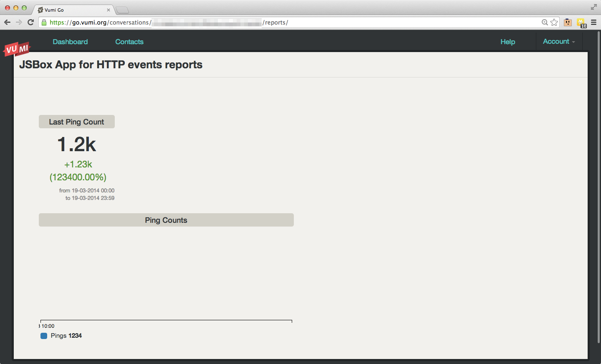

Pushing Metrics to Go over HTTP
===============================

1. Create a jsbox conversation with `config.js` and `reports.js` uploaded.
2. Create an HTTP conversation.
3. Hit it via curl::

    curl -X PUT \
        --user '<account-key>:<token>' \
        --data '[["total_pings", 1200, "MAX"]]' \
        https://go.vumi.org/api/v1/go/http_api_nostream/<conversation-key>/metrics.json \
        -vvv

4. Profit

